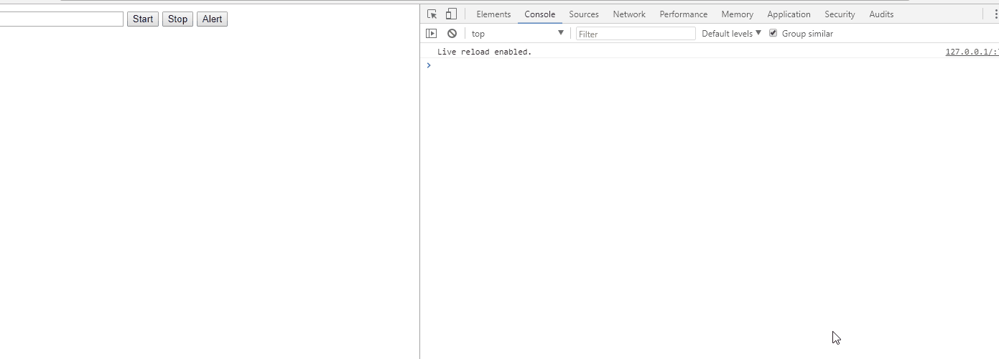

## JS 浏览器环境Worker多线程测试

## 使用说明
+ 多线程测试
  + 1.打开index.html
  + 2.先点击'Start'按钮
  + 3.点击'Alert'按钮。建议多等几秒钟再点击alert的'确定'
  + 4.可以看到input的value值会突然变大了
+ 

+ 单线程测试
  + 1.打开index_1.html
  + 2.先点击'Start'按钮
  + 3.点击'Alert'按钮。建议多等几秒钟再点击alert的'确定'
  + 4.可以看到input的value值会累加变大
+ 

## 参考文档
[haodawang](https://www.cnblogs.com/haodawang/articles/5850822.html)

